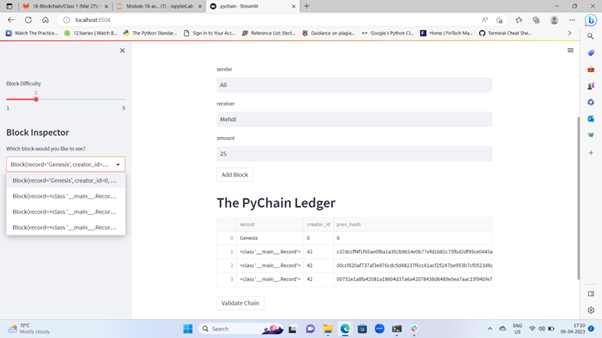
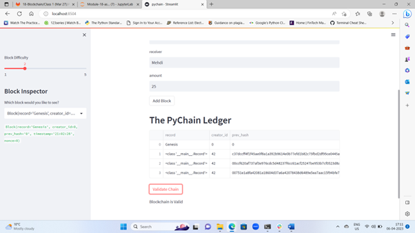

# Module-18-assignment

## Purpose of the assignment

The main goal of this assignment was to make the necessary changes to the PyChain ledger provided to us for creating a Streamlit application. 

Moreover, additional input areas were also to be created in order to prompt the user to provide additional data from their side. 

After making these changes we were suppose to test the PyChain ledger and check the validity of the blockchain on this application.

---

> This screenshot represents that multiple blocks have been created on this application as per the requirement. 

------

> Whilst the second screenshot indicates that the validity of the blockchain on this Streamlit application has been verified. 